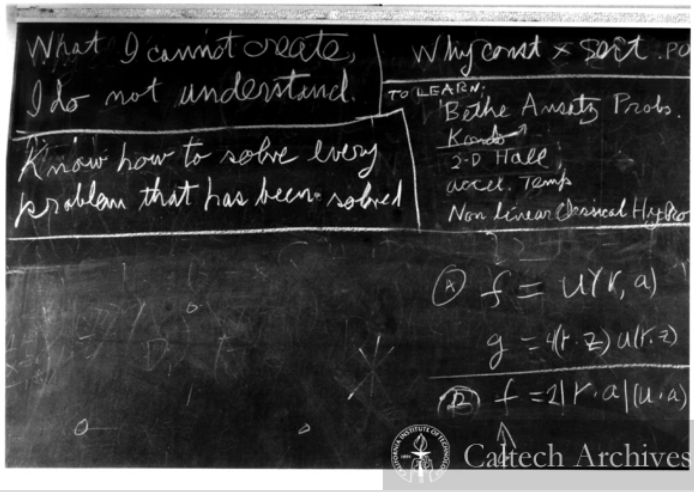
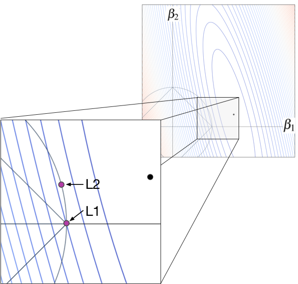
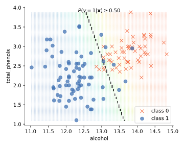
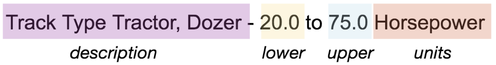
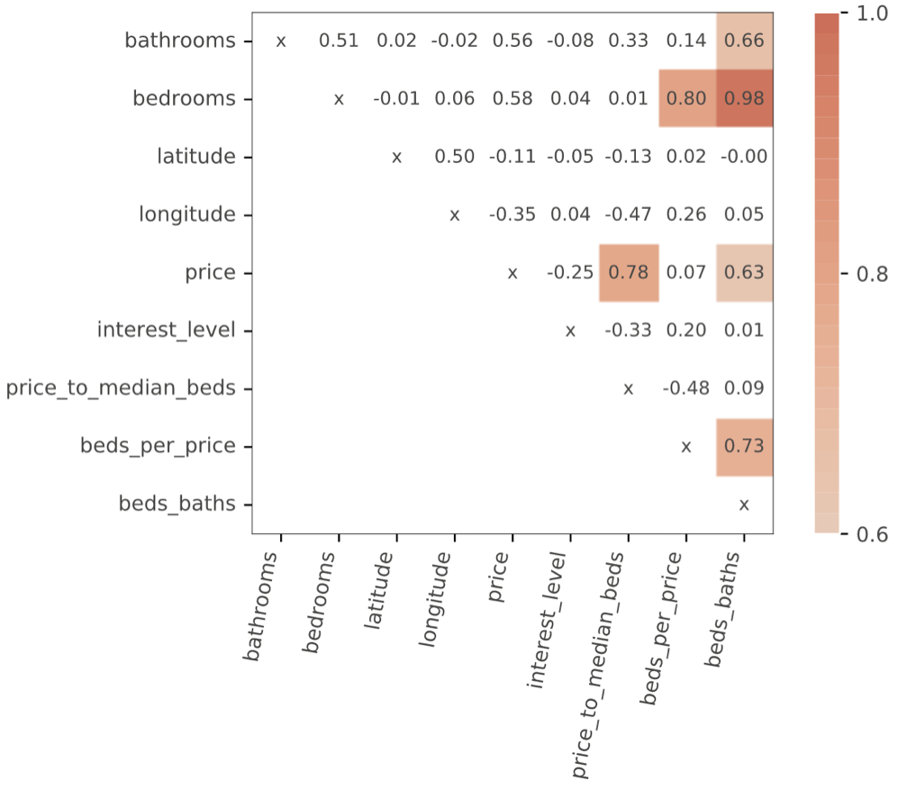
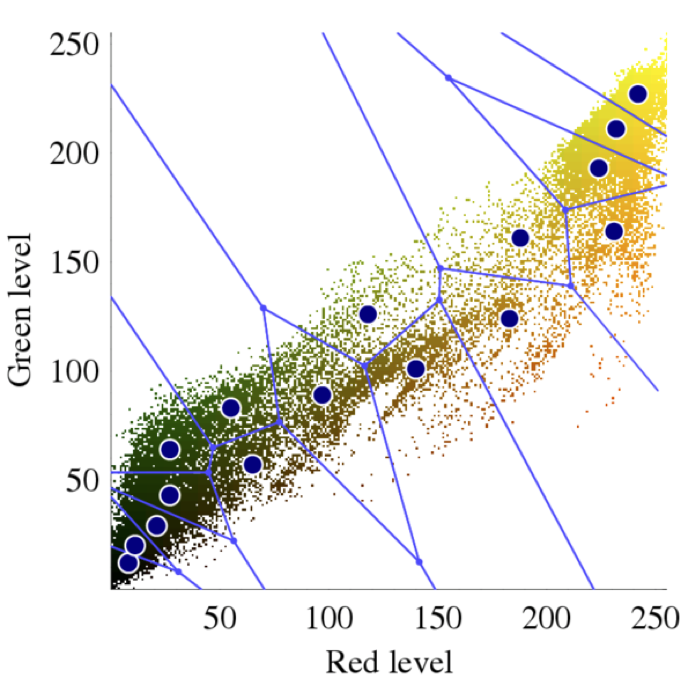

# MSDS621 Introduction to Machine Learning

“*In God we trust; all others bring data.*” — Attributed to W. Edwards Deming and George Box

This course introduces students to the key processes, models, and concepts of machine learning for tabular/structured data, such as:

* data cleaning
* dealing with missing data
* basic feature engineering
* feature selection
* model implementation
* model training
* model assessment
* mode interpretation

We study a few key models deeply, rather than providing a broad but superficial survey of models. As part of this course, students implement linear and logistic regression with regularization through gradient descent, a Naive Bayes model for text sentiment analysis, decision trees, and random forest models.   

Implementing these models yourself is critical to truly understanding them. As Richard Feynman wrote, "**What I cannot create, I do not understand.**" (From his blackboard at the time of his death.) With an intuition behind how the models work, you'll be able to understand and predict their behavior much more easily.

# Class details

**INSTRUCTOR.** [Terence Parr](http://parrt.cs.usfca.edu). I’m a professor in the computer science and [data science program](https://www.usfca.edu/arts-sciences/graduate-programs/data-science) departments and was founding director of the MS in Analytics program at USF (which became the MS data science program).  Please call me Terence or Professor (“Terry” is not ok).

**SPATIAL COORDINATES:** 

All lectures will be online via zoom thanks to COVID.

<!--
* Class is held at 101 Howard in 1st floor classroom 155-156.
* Exams are held in 154-156. Both sections meet together.
* My office is room 607 @ 101 Howard up on mezzanine above the open area on 5th floor
-->

**TEMPORAL COORDINATES.** Tue Jan 26 to Thu Mar 11.

* Lectures: 10AM - noon
* Exam 1: Tue Feb 23, 2021 3PM-4:30PM
* Exam 2: Thu Mar 11, 2021 10AM-11:30AM (last day of class)

<!--
* Exams: Fri 5-6PM Nov 8; Fri 10-11:30AM Dec 6; Room 154-156
-->

**INSTRUCTION FORMAT**. Class runs for 1:50 hours, 2 days/week. Instructor-student interaction during lecture is encouraged and we'll mix in mini-exercises / labs during class. All programming will be done in the Python 3 programming language, unless otherwise specified.

**COURSE BOOK**. [The Mechanics of Machine Learning](https://mlbook.explained.ai/) (in progress)

**TARDINESS.** Please be on time for class. It is a big distraction if you come in late.

## Student evaluation

| Artifact | Grade Weight | Due date |
|--------|--------|--------|
|[Linear models](https://github.com/parrt/msds621/raw/master/projects/linreg/linreg.pdf)| 10%| Tue Feb 9, 10:00AM |
|[Naive Bayes](https://github.com/parrt/msds621/blob/master/projects/bayes/bayes.ipynb) | 8% | Fri Feb 19, 11:59PM |
|[Decision trees](https://github.com/parrt/msds621/blob/master/projects/dtree/dtree.md) | 15% | Thur Mar 4, 11:59PM |
|[Random Forest](https://github.com/parrt/msds621/blob/master/projects/rf/rf.md) | 12% | Fri Mar 12, 11:59PM |
|Exam 1| 27%| Tue Feb 23, 3PM-4:30PM |
|Exam 2| 28%| Thu, Mar 11 10AM-11:30AM |

<!--
| Artifact | Grade Weight | Due date |
|--------|--------|--------|
|[Linear models](https://github.com/parrt/msds621/raw/master/projects/linreg/linreg.pdf)| 10%| Thu Oct 31, 11:59PM |
|[Naive Bayes](https://github.com/parrt/msds621/blob/master/projects/bayes/bayes.ipynb) | 8% | Monday Nov 11, 11:59PM |
|[Decision trees](https://github.com/parrt/msds621/blob/master/projects/dtree/dtree.md) | 15% | Mon Nov 25, 11:59PM |
|[Random Forest](https://github.com/parrt/msds621/blob/master/projects/rf/rf.md) | 12% | Sun Dec 8, 11:59PM |
|Exam 1| 27%| Fri Nov 8, 5PM-6PM |
|Exam 2| 28%| Fri, Dec 6 10AM-11:30AM |
-->

All projects will be graded with the specific input or tests given in the project description, so you understand precisely what is expected of your program. Consequently, projects will be graded in binary fashion: They either work or they do not. Each failed unit test gets a fixed amount off, no partial credit. The only exception is when your program does not run on the grader's or my machine because of some cross-platform issue or some obviously trivial problem. (Attention to detail is critical.  For example, if you return an integer from a function and my code expects a string, your code makes my code fail.) This is typically because a student has hardcoded some file name or directory into their program. In that case, we will take off *a minimum* of 10% instead of giving you a 0, depending on the severity of the mistake.  Please go to github and verify that the website has the proper files for your solution. That is what I will download for testing.

For some projects, I run a small set of hidden tests that you do not have. These are typically worth 10% and the only way to get into the 90% range is to produce code that works on more than just the tests you're given.

**No partial credit**. Students are sometimes frustrated about not getting partial credit for solutions they labored on that do not actually work. Unfortunately, "almost working" just never counts in a job situation because nonfunctional solutions have no value.  We are not writing essays in English that have some value even if they are not superb.  When it comes to software, there is no fair way to assign such partial credit, other than a generic 30% or whatever for effort.  The only way to determine what is wrong with your project is for me to fix and/or complete the project. That is just not possible for 90 students. Even if that were possible, there is no way to fairly assign partial credit between students.  A few incorrect but critical characters can mean the difference between perfection and absolute failure. If it takes a student 20 hours to find that problem, is that worth more or less partial credit than another project that is half-complete but could be finished in five hours? To compensate, I try to test multiple pieces of the functionality in an effort to approximate partial credit.

Each project has a hard deadline and only those projects working correctly before the deadline get credit.  My grading script pulls from github at the deadline.  *All projects are due at the start of class on the day indicated, unless otherwise specified.*

*I reserve the right to change projects until the day they are assigned.*

**Grading standards**. I consider an **A** grade to be above and beyond what most students have achieved. A **B** grade is an average grade for a student or what you could call "competence" in a business setting. A **C** grade means that you either did not or could not put forth the effort to achieve competence. Below **C** implies you did very little work or had great difficulty with the class compared to other students.

# Syllabus

## Notebooks

There are a number of notebooks associated with the lecture slides.

* [Linear models, regularization](https://github.com/parrt/msds621/tree/master/notebooks/linear-models/)
* [Binary trees, decision trees, bias-variance](https://github.com/parrt/msds621/tree/master/notebooks/trees/)
* [Model assessment](https://github.com/parrt/msds621/tree/master/notebooks/assessment/)
* [Clustering](https://github.com/parrt/msds621/tree/master/notebooks/clustering/)

The following notebook takes you through a number of important processes, which you are free to do at your leisure. Even if we haven't covered the topics in lecture, you can still get something out of the notebook.

* [Getting a sense of the training and testing procedure notebook](https://github.com/parrt/msds621/blob/master/notebooks/process/basic-process.ipynb)

## Getting started

The first lecture is an overview of the entire machine learning process:

[Overview](https://github.com/parrt/msds621/raw/master/lectures/overview.pdf) (Day 1)

## Regularization for linear models

This topic more or less finishes off the linear regression course you just finished.

* [Review of linear models](https://github.com/parrt/msds621/raw/master/lectures/review-linear-models.pdf) (slides) (Day 1)
	* [Lab: Plotting decision surfaces for linear models](https://github.com/parrt/msds621/blob/master/labs/linear-models/decision-surfaces.ipynb) (Day 1)
* [Regularization of linear models L1, L2](https://github.com/parrt/msds621/raw/master/lectures/regularization.pdf) (slides) (Day 2)
	* [Lab: Exploring regularization for linear regression](https://github.com/parrt/msds621/blob/master/labs/linear-models/regularization-regr.ipynb) (Day 2)
	* [Lab: Regularization for logistic regression](https://github.com/parrt/msds621/blob/master/labs/linear-models/regularization-logi.ipynb) (Day 3)
	* See my deep dive: [A visual explanation for regularization of linear models](https://explained.ai/regularization/index.html)

## Training linear models with gradient descent

This topic is required so we can train regularized linear models, and is critical to understanding neural networks that you'll study in a future class.

* [Gradient Descent optimization](https://github.com/parrt/msds621/raw/master/lectures/gradient-descent.pdf) (slides) (Day 3)
	* [Lab: Gradient descent in action](https://github.com/parrt/msds621/blob/master/labs/linear-models/gradient-descent.ipynb) (Day 3)
* (*[Regularization project](https://github.com/parrt/msds621/raw/master/projects/linreg/linreg.pdf)*)

## Models

We will learn 3 models in depth for this course: naive bayes, decision trees, and random forests but will examine k-nearest-neighbor (kNN) briefly.

* [Naive Bayes](https://github.com/parrt/msds621/raw/master/lectures/naive-bayes.pdf)  (slides) (Day 4)
  * [Lab: Naive bayes by hand](https://github.com/parrt/msds621/blob/master/labs/bayes/naive-bayes.ipynb) (Day 4)
  * (*[Naive Bayes project](https://github.com/parrt/msds621/blob/master/projects/bayes/bayes.ipynb)*)
* [Bias-variance trade-off](https://github.com/parrt/msds621/raw/master/lectures/bias-variance.pdf) (slides) (Day 4)
* [Intro to non-parametric machine learning models](https://github.com/parrt/msds621/raw/master/lectures/nonparametric-models.pdf) (slides) (Day 5)
* [Decision trees](https://github.com/parrt/msds621/raw/master/lectures/decision-trees.pdf) (slides) (Day 5)
  * [Lab: Partitioning feature space](https://github.com/parrt/msds621/blob/master/labs/trees/partitioning-feature-space.ipynb) (Day 6) (oops delay to Day 7 due to bug in lab code)
  * [Binary tree crash course](https://github.com/parrt/msds621/raw/master/lectures/binary-trees.pdf) (slides) (Day 6)
  * [Lab: Binary trees](https://github.com/parrt/msds621/blob/master/labs/trees/binary-trees.ipynb) (Day 6)
  * [Training decision trees](https://github.com/parrt/msds621/raw/master/lectures/training-decision-trees.pdf) (slides) (Day 7)
  * (*[Decision trees project](https://github.com/parrt/msds621/blob/master/projects/dtree/dtree.md)*) 
* [Random Forests](https://github.com/parrt/msds621/raw/master/lectures/random-forests.pdf) (slides) (Day 7, Day 8)
  * [Lab: Exploring Random Forests](https://github.com/parrt/msds621/blob/master/labs/trees/random-forests.ipynb) (Day 9)
  * (*[Random Forest project](https://github.com/parrt/msds621/blob/master/projects/rf/rf.md)*)

## Model assessment

* [Model assessment](https://github.com/parrt/msds621/raw/master/lectures/model-assessment.pdf) (slides) (Day 10)
* [Regressor and classifier metrics](https://github.com/parrt/msds621/raw/master/lectures/metrics.pdf) (slides) (Day 10)

## Mechanics

* [Preparing data for modeling](https://github.com/parrt/msds621/raw/master/lectures/data-prep.pdf) (slides) (Day 11)
* [Basic feature engineering](https://github.com/parrt/msds621/raw/master/lectures/feature-engineering.pdf) (slides) (Day 12, 13 (didn't get to log(y) discussion))

## Model interpretation

* [Feature importance](https://github.com/parrt/msds621/raw/master/lectures/feature-importance.pdf) (slides) (Day 14)
* Partial dependence

 
 

## Unsupervised learning

Clustering isn't used nearly as much as supervised learning, but it's an important part of your education  and is extremely useful in in certain circumstances, such as image color quantization. (Image credit [Wikipedia](https://en.wikipedia.org/wiki/Color_quantization).)

* [Clustering](https://github.com/parrt/msds621/raw/master/lectures/clustering.pdf) (slides)  (Day 14)
  * k-means clustering
  * Hierarchical clustering
  * Breiman's trick for clustering with RFs

  
# Administrivia

**ACADEMIC HONESTY.** You must abide by the copyright laws of the United States and academic honesty policies of USF. You may not copy code from other current or previous students. All suspicious activity will be investigated and, if warranted, passed to the Dean of Sciences for action.  Copying answers or code from other students or sources during a quiz, exam, or for a project is a violation of the university’s honor code and will be treated as such. Plagiarism consists of copying material from any source and passing off that material as your own original work. Plagiarism is plagiarism: it does not matter if the source being copied is on the Internet, from a book or textbook, or from quizzes or problem sets written up by other students. Giving code or showing code to another student is also considered a violation.

The golden rule: **You must never represent another person’s work as your own.**

If you ever have questions about what constitutes plagiarism, cheating, or academic dishonesty in my course, please feel free to ask me.

**Note:** Leaving your laptop unattended is a common means for another student to take your work. It is your responsibility to guard your work. Do not leave your printouts laying around or in the trash. *All persons with common code are likely to be considered at fault.*

**USF policies and legal declarations**

*Students with Disabilities*

If you are a student with a disability or disabling condition, or if you think you may have a disability, please contact <a href="/sds">USF Student Disability Services</a> (SDS) for information about accommodations.

*Behavioral Expectations*

All students are expected to behave in accordance with the <a href="https://usfca.edu/fogcutter">Student Conduct Code</a> and other University policies.

*Academic Integrity*

USF upholds the standards of honesty and integrity from all members of the academic community. All students are expected to know and adhere to the University's <a href="https://usfca.edu/academic-integrity/">Honor Code</a>.

*Counseling and Psychological Services (CAPS)*

CAPS provides confidential, free <a href="https://usfca.edu/student-health-safety/caps">counseling</a> to student members of our community.

*Confidentiality, Mandatory Reporting, and Sexual Assault*

For information and resources regarding sexual misconduct or assault visit the <a href="https://myusf.usfca.edu/title-ix">Title IX</a> coordinator or USFs <a href="http://usfca.callistocampus.org" target="_blank">Callisto website</a>.

