# Classifier and regressor decision trees

## Goal

Your goal is to implement decision trees for classification and regression as objects similar to sklearn's `DecisionTreeClassifier` and `DecisionTreeRegressor`.  This project can be challenging because you must recursively construct trees, but my solution is only 100 lines of Python with comments.

You will work in git repo `dtree`-*userid* and must create Python file `dtree.py`.

## Description

We will learn how to build a decision trees as part of our lectures but here's a brief synopsis. Decision trees partition feature space into hyper volumes with similar features, subject to the goal of reducing variance or impurity in the target y variable. For example, a regression of y against a single feature begins by finding the split point in x that gets two regions with the lowest average variance within those subregions. This is done by exhaustively testing locations in x space, computing the variance of y for observations to the left and the variance of observations on the right of the split point. The x location of the best average of these two variances is the split point. Then, the algorithm recursively splits the two new subregions. Here's what it looks like after 1, 2, and 3 recursive split operations (2, 4, and 8 subregions) for regression:

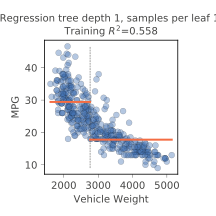 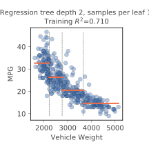 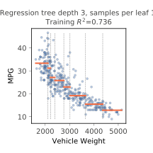

The same process works for classification. The only difference is that, instead of measuring MSE (or variance), we measure and try to reduce the uncertainty/purity ([gini impurity](https://en.wikipedia.org/wiki/Decision_tree_learning#Gini_impurity)) of the y values to the left and right of the split.

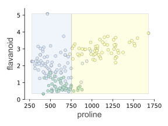 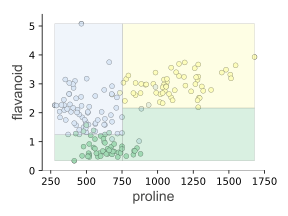 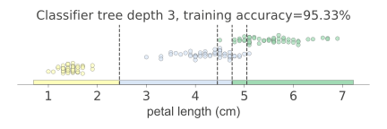

If you prefer, you can also look at the partitions with stacked bar charts using [dtreeviz](https://github.com/parrt/dtreeviz):
 
 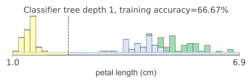

When moving beyond a single feature, during training, the decision tree must choose not only the split value but also the feature to test. Again, it exhaustively tries all combinations of features and feature values, looking for the lowest variance (regression) or highest purity (classification) to the left and right of the candidate split value. For example, here is what feature space looks like for 2 features from the mtcars data set:


And, from the IRIS data set, here is what partitioning looks like for two of those features for classification purposes.

 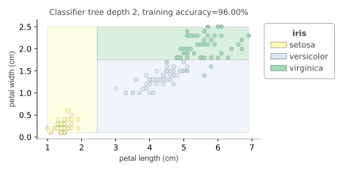

For 1 feature, we get ranges as hyper volumes. For 2 features, we get rectangular regions, and for 3 features we get rectangular volumes, etc... After that it's impossible to visualize but the same process holds. Partition the feature space into hyper volumes while trying to reduce variance or impurity in y after each split.

If you record the sequence of splits, you get a binary tree. For example, here is the classification tree for IRIS


### Functions and objects to build

First, define two classes that will represent the objects in your decision trees. You can build them however you want and put them anywhere in `dtree.py`, but here's the outline of how I built mine:

```
class DecisionNode:
    def __init__(self, col, split, lchild, rchild):
        self.col = col
        self.split = split
        self.lchild = lchild
        self.rchild = rchild

    def predict(self, x_test):
        # Make decision based upon x_test[col] and split
        ...
```

```
class LeafNode:
    def __init__(self, y, prediction):
        "Create leaf node from y values and prediction; prediction is mean(y) or mode(y)"
        self.n = len(y)
        self.prediction = prediction

    def predict(self, x_test):
        # return prediction
        ...
```

Those classes define the interior and leaf nodes of your decision trees. You can define your own objects, but make sure that your tree nodes respond to function `t.predict(x)` for some tree node `t` and 1D feature vector `x`.  In other words, performing method call `t.predict(x)` will invoke function `DecisionNode.predict(t,x)` or `LeafNode.predict(t,x)`, depending on the type of `t`.  That is what we call *dynamic dispatch* or *method invocation* (versus function call).

Now, we need objects to represent the regressors and classifiers. 
As we talked about, regressor and classifier implementation is virtually identical. The only difference is the loss function, MSE or gini impurity, and the prediction stored in leaves (mean or mode). We can squirrel away all of that common functionality in a generic `DecisionTree621` class:

```
class DecisionTree621:
    def __init__(self, min_samples_leaf=1, loss=None):
        self.min_samples_leaf = min_samples_leaf
        self.loss = loss # loss function; either np.std or gini

    def fit(self, X, y):
        """
        Create a decision tree fit to (X,y) and save as self.root, the root of
        our decision tree, for either a classifier or regressor.  Leaf nodes for classifiers
        predict the most common class (the mode) and regressors predict the average y
        for samples in that leaf.  
              
        This function is a wrapper around fit_() that just stores the tree in self.root.
        """
        self.root = self.fit_(X, y)
        
    def fit_(self, X, y):
        """
        Recursively create and return a decision tree fit to (X,y) for
        either a classifier or regressor.  This function should call self.create_leaf(X,y)
        to create the appropriate leaf node, which will invoke either
        RegressionTree621.create_leaf() or ClassifierTree621. create_leaf() depending
        on the type of self.
        
        This function is not part of the class "interface" and is for internal use, but it
        embodies the decision tree fitting algorithm.

        (Make sure to call fit_() not fit() recursively.)
        """
        ...
        
    def predict(self, X_test):
        """
        Make a prediction for each record in X_test and return as array.
        This method is inherited by RegressionTree621 and ClassifierTree621 and
        works for both without modification!
        """
        ...
```

Then, the `RegressionTree621` can *inherit* the `fit` and `predict` methods from `DecisionTree621`:

```
class RegressionTree621(DecisionTree621):
    def __init__(self, min_samples_leaf=1):
        super().__init__(min_samples_leaf, loss=np.std)
    def score(self, X_test, y_test):
        "Return the R^2 of y_test vs predictions for each record in X_test"
        ...
    def create_leaf(self, y):
        """
        Return a new LeafNode for regression, passing y and mean(y) to
        the LeafNode constructor.
        """
        ...
```

In essence, we are designing a new class as it differs from the parent class. We are inheriting `fit` and `predict` methods and defining `score` and `create_leaf`. You can think of inheriting as including or copying the functions from the *superclass*.

`ClassifierTree621` also inherits from methods from `DecisionTree621`:

```
class ClassifierTree621(DecisionTree621):
    def __init__(self, min_samples_leaf=1):
        super().__init__(min_samples_leaf, loss=gini)
    def score(self, X_test, y_test):
        "Return the accuracy_score() of y_test vs predictions for each record in X_test"
        ...
    def create_leaf(self, y):
        """
        Return a new LeafNode for classification, passing y and mode(y) to
        the LeafNode constructor.
        """
        ...
```

All of this object-oriented programming mumbo-jumbo is a bit overwhelming at first, but it's crucial to implementing models that look like sklearn models.  It also makes it easier to use these models when they are classes. 

Object-oriented programming is probably unfamiliar to you, but there is plenty of material on the web (most of it is crap though).  You can check out [my OO summary](https://github.com/parrt/msds501/blob/master/notes/OO.ipynb), which sucks slightly less than other stuff on the web. 

You must also need a function that implements the gini impurity score, as shown at Wikipedia:

```
def gini(y):
    "Return the gini impurity score for values in y"
```

It is passed to the `DecisionTree621` constructor by `ClassifierTree621`'s constructor as the loss function.

### Training algorithm

The training algorithm, embodied by function `fit_()`, exhaustively tries combinations of features and feature values, looking for an optimal split.  The optimal split is one that splits a feature space for one feature into two sub-regions and the average variance (regression) or impurity (classification) is lower than that of the current node's observations *and* any other feature/value split.  

The first decision node is created by looking at the entire set of training records in X, y. Once split into two regions, training recursively splits those two regions. In this way, different subsamples of the training data are examined to create the decision nodes of the tree. If every decision node split the current set of samples exactly in half, than the height of the tree would be roughly `log(len(X))`.  Training returns a leaf node when there are less than or equal to `min_samples_leaf` observations in a subsample.

The algorithm looks like this:

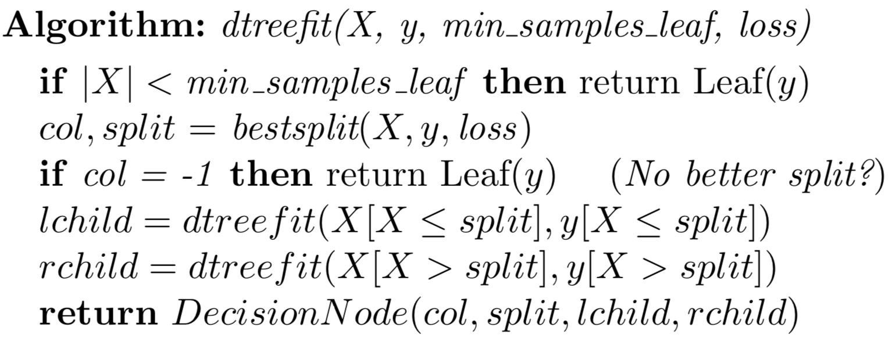

Finding the optimal split looks like this:

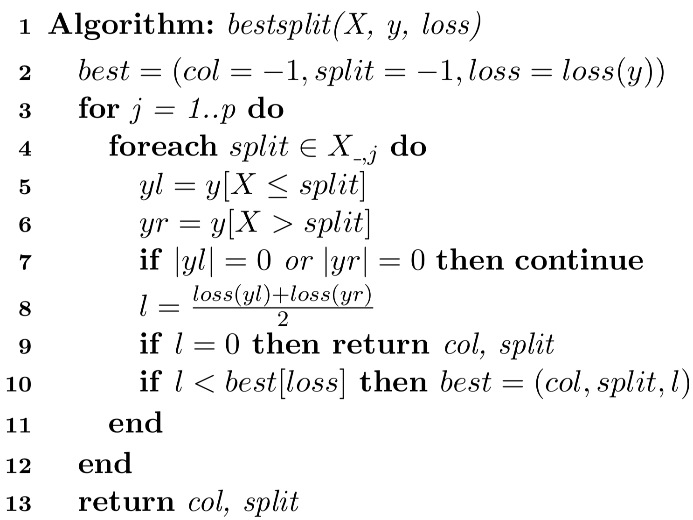

In our case, for speed reasons (and to improve generality), we're going to pick a subset of all possible split values.   Choose k=11 for our project.

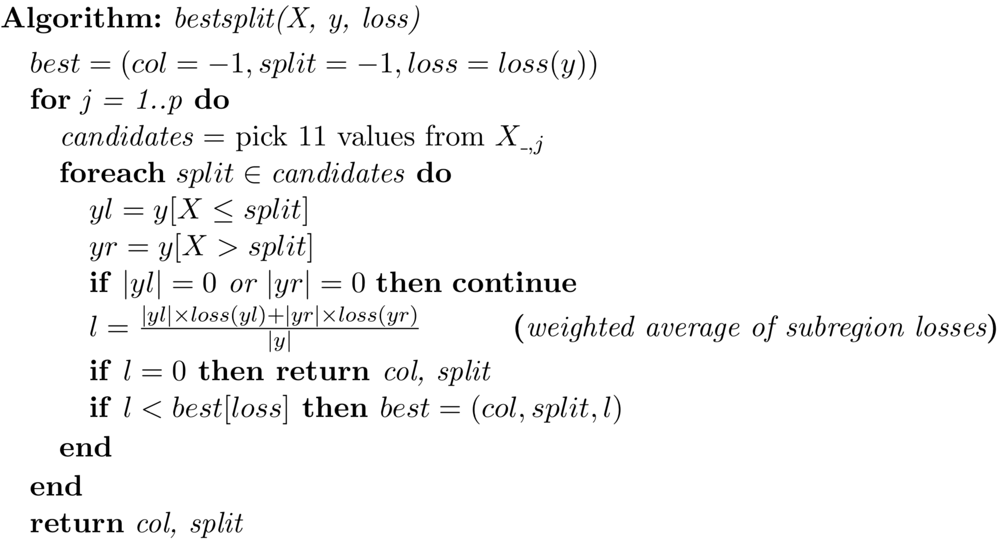

We could also improve generality by picking splits midway *between* X values rather than at X values, but that means sorting or scanning values looking for the nearest value less than the split point.

### Prediction algorithm

To make a prediction for a feature vector *x*, we start at the root node and descend through the decision nodes to the appropriate leaf. At each decision node, we test a specific variable's value, *x[j]*, against the split value stored in the decision node. If *x[j]* is less than or equal to the split value, prediction descends down the left child. Otherwise, prediction descends down the right child. Upon reaching a leaf, we predict either the most common class or the average value among the *y* targets associated with that leaf. Here is the algorithm:

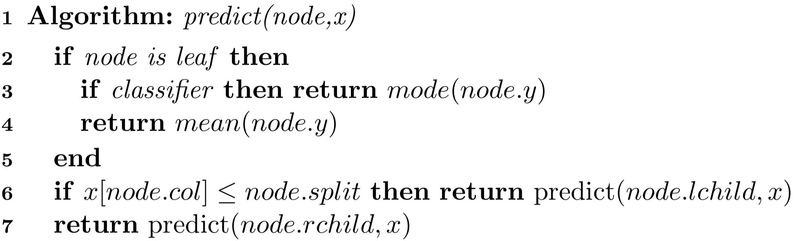

In our project, we are breaking up this algorithm actually into two main parts, one for the decision nodes and one for the leaves. That is why you see the same method repeated in the class definitions associated with binary trees:

```
class DecisionNode
    def predict(self, x_test):
        # Make decision based upon x_test[col] and split
        # lines 6 and 7 from predict() algorithm above

class LeafNode:
    def predict(self, x_test):
        # return prediction passed to constructor of LeafNode
        # lines 3,4 from algorithm above
```

The `DecisionNode.predict()` method invokes `predict()` on the left or right child depending on `x_test`'s values.  The leaf node just returns the prediction (mean or mode) passed into the constructot for `LeafNode`, so it deviates a bit from the `predict()` algorithm.  

## Getting started

1. Download the [test script](https://github.com/parrt/msds621/tree/master/projects/dtree)
2. Create blank script file `dtree.py` with perhaps `import numpy as np` as starter code
3. Cut/paste my definitions of `DecisionNode` and `LeafNode` into `dtree.py` if you plan on using those, but you are free to use your own binary tree implementation
4. Add the files to your repository, commit, and push back to github. 

In this way, you have started on the project without actually having to do any work. Getting over inertia is an important step in any project.
 
## Deliverables

In your github repo `dtree`-*userid*, you must provide the `dtree.py` file at the root of the repository directory.  It must have the `RegressionTree621` and `ClassifierTree621` classes as well as the decision tree node classes; basically all of your code will be in this file. My test script will import all functions and classes.  Please make sure there is no main program in `dtree.py` (as it runs when we do an import).

I will copy in clean versions of the test script before grading your projects.

## Evaluation

Your code will be tested using the unit tests provided to you as part of this project. There are two regression and three classification toy data sets. Hopefully, getting even one of the tests to pass means you will get all of the test to pass. Each `test_dtree.py` test failure costs 10%.

I also have created a hidden test on a different data set and failing it costs 15% of your grade.

```
$ python -m pytest -v test_dtree.py 
================================ test session starts =================================
platform darwin -- Python 3.7.1, pytest-4.0.2, py-1.7.0, pluggy-0.8.0 -- ...
cachedir: .pytest_cache
rootdir: /Users/parrt/courses/msds621-private/projects/dtree, inifile:
plugins: remotedata-0.3.1, openfiles-0.3.1, doctestplus-0.2.0, arraydiff-0.3
collected 7 items                                                                    

test_dtree.py::test_boston PASSED                                              [ 14%]
test_dtree.py::test_boston_min_samples_leaf PASSED                             [ 28%]
test_dtree.py::test_california_housing PASSED                                  [ 42%]
test_dtree.py::test_iris PASSED                                                [ 57%]
test_dtree.py::test_wine PASSED                                                [ 71%]
test_dtree.py::test_wine_min_samples_leaf PASSED                               [ 85%]
test_dtree.py::test_breast_cancer PASSED                                       [100%]

============================= 7 passed in 28.53 seconds ==============================
```

*My test script completes in less than 30 seconds and I will take off 10% if your test takes longer than one minute. Please pay attention to efficiency.*

### Automatic testing using github actions

As with the previous projects, I have provided a [Github actions](https://docs.github.com/en/free-pro-team@latest/actions) file for you to get automatic testing. All you have to do is put the [test.yml](https://github.com/parrt/msds621/blob/master/projects/dtree/test.yml) file I have prepared for you into repo subdirectory `.github/workflows`, commit, and push back to github. Then go to the Actions tab of your repository.

Naturally it will only work if you have your software written and added to the repository. Once you have something basic working, this functionality is very nice because it automatically shows you how your software is going to run on a different computer (a linux computer). This will catch the usual errors where you have hardcoded something from your machine into the software. It also gets you in the habit of committing software to the repository as you develop it, rather than using the repository as a homework submission device.

If you want to get fancy, you can use the following "badge" code in your repo README.md file:

```
Test naive bayes


```
