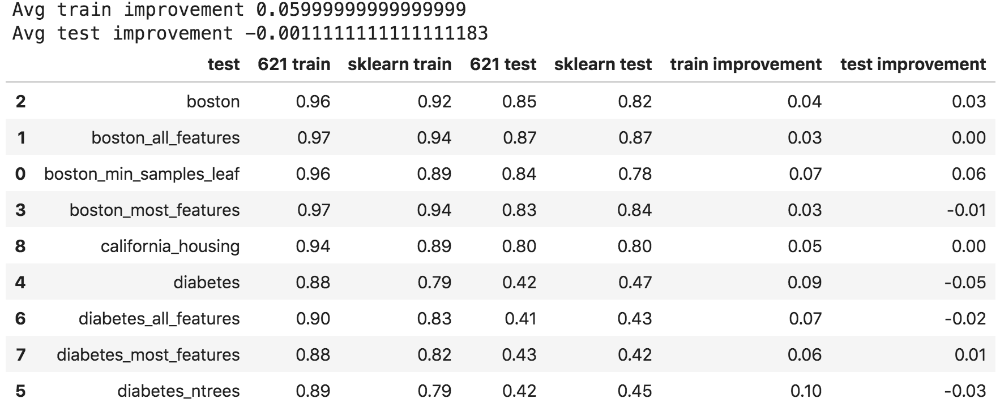
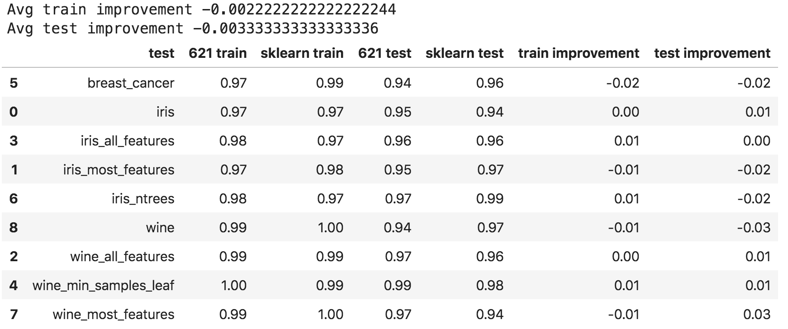

#  Random Forests

## Goal

The goal of this project is to leverage the decision tree implementation from the previous project to make a random forest implementation. The goal is to build the simplest possible functional random forest without concern for efficiency but with accuracy comparable to sklearn. You will create objects `RandomForestRegressor621` and `RandomForestClassifier621` as drop in replacements for sklearn's implementations. My implementation is about 100 lines of code, but minor changes are also required to the decision tree implementation in `dtree.py`.

Your implementation must include code to support out-of-bag (OOB) validation error estimation. It's a bit tricky to get right, so the OOB unit tests are worth less in my evaluation. You can still get 92% total, even if you don't implement OOB error estimation.

You will work in git repo `rf`-*userid* and create `rf.py` in the root directory of the repo. Also copy your `dtree.py` from the previous project into the root directory, as you will need to modify it and use it for this project.

## Description

Classification and regression trees do an excellent job of fitting a model to the training data. Unfortunately, decision trees are a little too good and they overfit like mad, meaning that they do not generalize well to previously-unseen test data. To increase generality, random forests use a collection of decision trees that have been weakened to make them more independent. We trade a bit of bias for dramatically improved generality.

A random forest does not feed all data to every decision tree in its collection. Each tree is trained on a bootstrapped version of the original training set. Further, RFs must sometimes forget some of the available features during training. In our case, decision node splitting will be limited to considering a random selection of features of size `max_features`, a hyper parameter not used in our decision trees. Naturally, both of bootstrapping and setting a maximum features per split introduce bias into the individual decision trees. But, averaging results of these tree estimators brings the bias back down. We get the best of both worlds!

### Bootstrapping

The goal of bootstrapping for random forests is to train a number of decision trees that are as independent as possible by using different but similar training sets.  Each tree trains on a slightly different subset of the training data. Bootstrapping, in theory, asks the underlying distribution that generated the data to generate another independent sample. In practice, bootstrapping gets about 2/3 of the X rows, leaving 1/3 "out of bag" (OOB). See [sklearn's resample function](https://scikit-learn.org/stable/modules/generated/sklearn.utils.resample.html) for a handy way to get a list of indexes to help create a bootstrap sample training set. For example, if I have a numpy array with a list of indexes in `idx` from `X`, then `X[idx,:]`  is a list of rows from 2D matrix `X`.

The algorithm for fitting a random forest is then:


### Changes to decision tree training

There are two important changes we need to make to the decision tree mechanism so that it is suitable for random forests.

First, we need to update the interface for our decision nodes so that decision trees know how to return the leaf of the tree that should make the prediction, rather than the prediction itself as `predict()` does.   To produce a weighted average, we need to know not just the prediction, but also the number of samples within that leaf. (The `predict()` function only returns the prediction.)

```
class DecisionNode:
    def __init__(self, col, split, lchild, rchild):
        self.col = col
        self.split = split
        self.lchild = lchild
        self.rchild = rchild
    def predict(self, x_test):
        ...
    def leaf(self, x_test):
        """
        Given a single test record, x_test, return the leaf node reached by running
        it down the tree starting at this node.  This is just like prediction,
        except we return the decision tree leaf rather than the prediction from that leaf.
        """
        ...
```

A `LeafNode` obviously just returns itself (`self`) rather than the prediction.

The second change is in the training mechanism. The  decision tree for looks like:


For fitting conventional decision trees, `bestsplit()` exhaustively scans all available features and the feature values looking for the optimal variable/split combination. To reduce overfitting, each split should pick from a random subset of the features; the subset size is the hyper perimeter `max_features`.  Function `np.random.choice()` is useful here to get a list of feature indexes and then `X[:, i]` gives us the ith column.  In my solution,  the change is to the outermost loop in `find_best_split()`:


### RF Prediction

Once we've trained a forest of decision trees, we can make predictions for one or more feature vectors using `predict()`. For regression, the prediction for the forest is the weighted average of the predictions from the individual decision trees. If `X_test` passed to `predict()` is a two-dimensional matrix of *n* rows, then *n* predictions should be returned in an array from `predict()`. To make a prediction for a single feature vector, call `leaf()` on each tree to get the leaf node that contains the prediction information for the feature vector.  Each leaf has `n`, the number of observations in that leaf that can serve as our weight. The leaf also has a `prediction` that is the predicted y value for regression or class for classification. (We'll deal with classification separately.) First, compute the total weight of all `leaf.n` and then compute the sum of `leaf.prediction * leaf.n`. The prediction is then the weighted sum divided by the total weight.

For classification, it's a little more complicated Because we need a majority vote across all trees.  As with regression, go through all of the trees, and get the leaves associated with the prediction of a single feature vector.  Create a numpy array, say, `class_counts` that is big enough so that the maximum integer representing a class is a valid index in the array. Then, `class_counts[c]` gives the count associated with class `c`.  Add `leaf.n` to the `class_counts[leaf.prediction]` count. The class with the largest count should be the prediction; `np.argmax` is useful here.


###  Regressor and classifier class definitions

To mimic sklearn machine learning models, we need to create some class definitions. You are free to implement the regression and classifier tree objects as you like, but you must satisfy the appropriate interface so that the unit tests will run.  Here is my setup:


The `RandomForest621` class has my generic `fit()` method that is inherited by subclasses `RandomForest Regressor621` and `RandomForestClassifier621`. 

Method `compute_oob_score()` is just a helper method that I used to encapsulate that functionality, but you can do whatever you want. `RandomForest621.fit()` calls  `self.compute_oob_score()` and that calls the implementation either in regressor or classifier, depending on which object I created.

You can use the following class definitions as templates:

```
class RandomForest621:
    def __init__(self, n_estimators=10, oob_score=False):
        self.n_estimators = n_estimators
        self.oob_score = oob_score
        self.oob_score_ = np.nan

    def fit(self, X, y):
        """
        Given an (X, y) training set, fit all n_estimators trees to different,
        bootstrapped versions of the training data.  Keep track of the indexes of
        the OOB records for each tree.  After fitting all of the trees in the forest,
        compute the OOB validation score estimate and store as self.oob_score_, to
        mimic sklearn.
        """
        ...
```

```
class RandomForestRegressor621(RandomForest621):
    def __init__(self, n_estimators=10, min_samples_leaf=3, max_features=0.3, oob_score=False):
        super().__init__(n_estimators, oob_score=oob_score)
        self.trees = ...

    def predict(self, X_test) -> np.ndarray:
        """
        Given a 2D nxp array with one or more records, compute the weighted average
        prediction from all trees in this forest. Weight each trees prediction by
        the number of samples in the leaf making that prediction.  Return a 1D vector
        with the predictions for each input record of X_test.
        """
        ...
        
    def score(self, X_test, y_test) -> float:
        """
        Given a 2D nxp X_test array and 1D nx1 y_test array with one or more records,
        collect the prediction for each record and then compute R^2 on that and y_test.
        """
        ...
```

```
class RandomForestClassifier621:
    def __init__(self, n_estimators=10, min_samples_leaf=3, max_features=0.3, oob_score=False):
        super().__init__(n_estimators, oob_score=oob_score)
        self.n_trees = n_trees
        self.min_samples_leaf = min_samples_leaf
        self.trees = ...

    def predict(self, X_test) -> np.ndarray:
        ...
        
    def score(self, X_test, y_test) -> float:
        """
        Given a 2D nxp X_test array and 1D nx1 y_test array with one or more records,
        collect the predicted class for each record and then compute accuracy between
        that and y_test.
        """
        ...    
```

## Getting started

Download the [test scripts](https://github.com/parrt/msds621/tree/master/projects/rf) and create blank script file `rf.py` with perhaps `import numpy as np` as starter code.  Copy your `dtree.py` script from the previous project into this new `rf-`*userid* project directory as well.  Make sure that you are creating files in the root directory of the repository. Add the files to your repository, commit, and push back to github.

In this way, you have started on the project without actually having to do any work. Getting over inertia is an important step in any project.

## Out-of-bag (OOB) error

The R^2 and accuracy scores for OOB observations is an accurate estimate of the validation error, all without having to manually hold out a validation or test set. This is a major advantage of random forests.

A bootstrapped sample is roughly 2/3 of the training records for any given tree, which leaves 1/3 of the samples (OOB) as test set. After training each decision tree, keep track of the OOB records in the tree.  For example, I do `t = ...` inside my `fit()` method (for each tree `t`).  After training all trees in `fit()`, loop through the trees again and compute the OOB score, if hyperparameter `self.oob_score` is true. Saves the score in `self.oob_score_` for either the RF regressor or classifier object, which is consistent with the sklearn implementation. See the class lecture slides for more details, but here are the algorithms again:


## Deliverables

In your github repo `rf`-*userid*, you must provide the following files at the root of the repository directory:

* `dtree.py` This is the code from your previous project  but with the updates specified above to randomly select from a subset of the features during each split.
* `rf.py` This is file containing your `RandomForestRegressor621` and `RandomForestClassifier621` implementations, and any other functions or classes you need.

I will copy in a clean version of the test script before grading your projects.

## Evaluation

Because these tests take so long and they are completely independent, we can test a number of them in parallel to speed things up. 

```
$ pip install pytest-xdist
```

For me, it's 3x faster when I use `-n 8` option (on my 4-core fast intel i7 CPU).  Here is the output I get: 

```
$ pytest -v -n 8 test_rf.py
test_rf.py::test_diabetes 
test_rf.py::test_diabetes_ntrees 
test_rf.py::test_boston 
test_rf.py::test_boston_oob 
test_rf.py::test_boston_min_samples_leaf 
test_rf.py::test_boston_min_samples_leaf_oob 
test_rf.py::test_boston_all_features 
test_rf.py::test_boston_most_features 
[gw6] [  3%] PASSED test_rf.py::test_diabetes 
test_rf.py::test_iris 
[gw6] [  7%] PASSED test_rf.py::test_iris 
test_rf.py::test_iris_most_features 
[gw0] [ 11%] PASSED test_rf.py::test_boston 
test_rf.py::test_diabetes_all_features 
[gw1] [ 15%] PASSED test_rf.py::test_boston_oob 
test_rf.py::test_diabetes_most_features 
[gw6] [ 19%] PASSED test_rf.py::test_iris_most_features 
test_rf.py::test_iris_oob 
[gw6] [ 23%] PASSED test_rf.py::test_iris_oob 
test_rf.py::test_wine_most_features 
[gw7] [ 26%] PASSED test_rf.py::test_diabetes_ntrees 
test_rf.py::test_iris_all_features 
[gw7] [ 30%] PASSED test_rf.py::test_iris_all_features 
test_rf.py::test_wine_min_samples_leaf 
[gw6] [ 34%] PASSED test_rf.py::test_wine_most_features 
test_rf.py::test_wine_oob 
[gw7] [ 38%] PASSED test_rf.py::test_wine_min_samples_leaf 
test_rf.py::test_wine_min_samples_leaf_oob 
[gw6] [ 42%] PASSED test_rf.py::test_wine_oob 
test_rf.py::test_breast_cancer 
[gw2] [ 46%] PASSED test_rf.py::test_boston_min_samples_leaf 
test_rf.py::test_diabetes_oob 
[gw5] [ 50%] PASSED test_rf.py::test_boston_min_samples_leaf_oob 
test_rf.py::test_iris_ntrees 
[gw7] [ 53%] PASSED test_rf.py::test_wine_min_samples_leaf_oob 
test_rf.py::test_breast_cancer_oob 
[gw5] [ 57%] PASSED test_rf.py::test_iris_ntrees 
[gw6] [ 61%] PASSED test_rf.py::test_breast_cancer 
[gw1] [ 65%] PASSED test_rf.py::test_diabetes_most_features 
test_rf.py::test_wine_all_features 
[gw2] [ 69%] PASSED test_rf.py::test_diabetes_oob 
[gw7] [ 73%] PASSED test_rf.py::test_breast_cancer_oob 
[gw1] [ 76%] PASSED test_rf.py::test_wine_all_features 
[gw0] [ 80%] PASSED test_rf.py::test_diabetes_all_features 
test_rf.py::test_wine 
[gw0] [ 84%] PASSED test_rf.py::test_wine 
[gw4] [ 88%] PASSED test_rf.py::test_boston_most_features 
test_rf.py::test_california_housing_oob 
[gw3] [ 92%] PASSED test_rf.py::test_boston_all_features 
test_rf.py::test_california_housing 
[gw4] [ 96%] PASSED test_rf.py::test_california_housing_oob 
[gw3] [100%] PASSED test_rf.py::test_california_housing
=============================== warnings summary ===============================
...
======================== 26 passed, 7 warnings in 83.78s (0:01:23) ========================
```

PyCharm knows how to do this as well, if you look at the configurations and add `-n 6` or `-n 8` as an additional argument to run six unit tests at once::


There are 8 OOB tests and each failed test costs you 1%, for total of 92% maximum if you don't implement this functionality.

The other unit tests check basic regression classification but also try out combinations of `max_features`, `min_samples_leaf`, `n_estimators`.   For the non-OOB tests, each failed test cost you 5%.

*My test passes in roughly 90 seconds and you will lose 10% if all tests takes longer than about 180 seconds total, running in parallel with -n 8.*

I ran some experiments and found the following results for one run.





In summary, my implementation is about as good as sklearn for both regression and classification (despite using k=11 not all X_i column values during splitting). For regression, however, my models were able to capture the training data better than sklearn. We usually don't care about the training error, but it's still interesting.